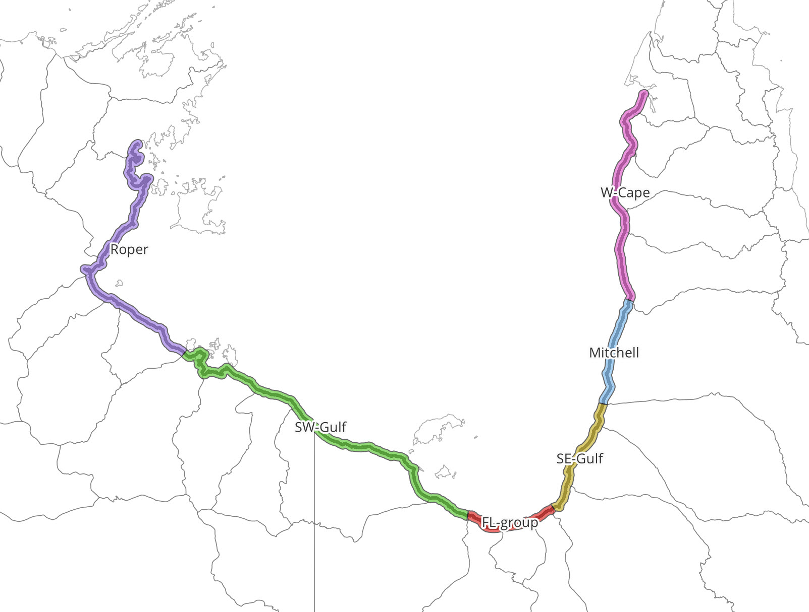

# eAtlas processing scripts for Gulf of Carpentaria Mangrove Dieback (NESP TWQ 4.13, JCU) data
Eric Lawrey - 6 June 2024

This document records the processing undertaken by the eAtlas team when publish datasets from research project NESP TWQ 4.13. These processing steps were performed to transform the original source project data into a form suitable for web delivery. 

## Mangrove Shoreline Aerial Surveys
**Original:** NESP_GOC_AerialSurveys_2017_2019.xlsx; Original Aerial JPEG images.
**Transformed:** GOC_NESP-4-13_JCU_AerialSurveys_2017_2019_Shoreline_DB.shp; Downsampled Aerial JPEG images.

This transformation included:
- Converting the Shoreline Database from a spreadsheet to a shapefile. Joining in shore line dieback assessment into the table of images. 
- Adjusting the names of the attributes to fit with limitations of shapefiles.
- Downsampling and recompressing the original imagery to shrink the image data from the original 310 GB down to 40 GB. The resolution reduction (6 M pixel images) and compression levels (85% JPEG quality) were chosen carefully so that nearly all the useable information is retained in the compressed version of the data. This compression makes it much more feasible to share the dataset, and makes browsing and using the imagery much faster. Note: The original source imagery will be available on request.
- Splitting the images into regional sub-directories. To limit the number of images in each directory and to allow users to download only regions that they care about we split the data into 6 sections along the coast. For this we split them based on river catchment divisions used in the project report.


## Data Dictionary:

### GOC_NESP-4-13_JCU_AerialSurveys_2017_2019_Shoreline_DB.shp
In the following list of attributes the first name corresponds to the name in the original data (NESP_GOC_AerialSurveys_2017_2019.xlsx) and the name in the shapefile.

- **Shore_FID:** Shore_FID. Identifier of the segment along the shoreline transect. This is a continuous counter from 1 (North West of Gulf of Carpentaria) to 19534 (Western side of Cape York). Each segment is space approxiately 100 m apart. Images in the survey are aligned to the closest transect segment. This allows the repeat surveys over multiple years to be compared.
- **Image_ID_2017:** ImgID_2017. Name of the original 2017 aerial photograph, prior to adding the Shore_FID to the image filename.
- **Image_ID_2019:** ImgID_2019. Name of the original 2019 aerial photograph, prior to adding the Shore_FID to the image filename.
- **X_2017:** X_2017. ??
- **X_2019:** X_2019. ??
- **Shore_Mangrove:** Shore_Mang. 
- **Density:** Density.
- **Type:** Type.
- **Dieback:** Dieback.
- **ImageCount:** Number of survey images in each transect segment. 0 - No survey imagery, 1 - One image from either 2017 or 2019, 2 - images from both 2017 and 2019.
- **Division:** Division of the shoreline into sections correspond to major river catchments. The Division attribute is the human readable version of the division name.
- **DivShort:** Short version of the division name. This is used for the directories that the images are stored in. Having the images split into these regions limits the number of images per directory and allows users to download a division subsection of the imagery. 
    - **Division (DivShort)**
    - Roper (Roper)
    - South-West Gulf (SW-Gulf)
    - Flinders-Leichhardt (FL-group)
    - South-East Gulf (SE-Gulf)
    - Mitchell (Mitchell)
    - Western Cape (W-Cape)
- **LabelScale:** Lower the number the more important the label. 1 - 2000 points apart, 2 - 1000 points apart, 3 - 500 points apart, etc.
- **GroupID:** Which block of 250 Shore_FIDs this image corresponds to. 
- **GroupRange:** Grouping of images into blocks of 250 Shore_FIDs. This is used to sort the photos into folders.


## Processing:
This section documents the transformation from the original data to the version used for the web mapping and the downsampled compressed version of the imagery.

### Tools:
- QGIS: This was used for shapefile preparation.
- Python: This was used for downsampling and compressing the imagery, and filing them in the DivShort directories.

### Processing steps:
1. In the next couple of steps we take the transect locations (points), convert it into a line segment, buffer it to make a polygon (a long narrow polygon along the coast), then cut this up into the divisions. We then use this, with a spatial join, to assign the divisions back to the original transect locations.
Using excel we export the `NESP_GOC_AerialSurveys_2017_2019.xlsx / Shoreline_Image_Database_17_19` was exported as a CSV (`NESP_GOC_AerialSurveys_2017_2019_Shoreline_DB.csv`).

2. This CSV was then loaded into Excel to shortern the attribute names to be compatible with shapefiles. 
- **Original attribute: Shapefile attribute**
- Shore_FID: Shore_FID
- Image_ID_2017: ImgID_2017
- Image_ID_2019: ImgID_2019
 We then load this into QGIS.

3. `Vector creation > Points to path`
Input layer: NESP_GOC_AerialSurveys_2017_2019_Shoreline_DB
Order expression: Shore_FID
Paths: (Create temporary layer)
4. `Vector > Geoprocessing tools > Buffer`
Input layer: Paths
Distance: 0.05 degrees

5. To split the data into difference regions we imported the `Australian River Basins 1997 (GA)` [dataset](https://eatlas.org.au/data/uuid/ea0a81fd-c864-4035-b51a-e214fa0a57b4) from the eAtlas into QGIS. This was used to divide the data into the following regions:
- Roper (Roper)
- South-West Gulf (SW-Gulf)
- Flinders-Leichhardt (FL-group)
- South-East Gulf (SE-Gulf)
- Mitchell (Mitchell)
- Western Cape (W-Cape)
Using Figure 2.1 from Duke et al. (2020) as a guide. The short names are intended for file paths and so need to be short and were inspired by Figure 1.4.

6. We then enabled editing on this feature and used the `Split Features` editing tool to cut the buffered line into segments matching the river boundaries.

7. Attributes were added to record the division name:
Name: Divison
Type: Text
Length: 20

Name: DivShort
Type: Text
Length: 15



This was then saved as `GOC_AIMS_Shore-drainage-divisions.shp`.

8. The run `python 01-prepare-shapefile-from-excel.py`. This script prepares a shapefile for the GeoServer.


 
## Study region map for the metadata page


15. Create a simplified version of GOC_AIMS_Shore-drainage-divisions for the metadata page.
`Vector > Geometry Tools > Simplify`
Input layer: GOC_AIMS_Shore-drainage-divisions
Tolerance: 0.02
Simplified: (Create temporary layer)

`Vector > Geoprocessing Tools > Dissolve`
Input layers: Simplified
Dissolve: (Create temporary layer)

`Right click > Export > Save Features As ...`
Format: GeoJSON
Filename: derived\\Shoreline_DB\\GOC_NESP-4-13_JCU_AerialSurveys_Study-area.geojson
Layer Options, COODINATE_PRECISION: 5

## Creating down sampled compressed versions of the original imagery
To reduce the size of the dataset to a managable size (40GB) we resize the original imagery, sorting it into regional subfolders to limit the number of images per folder. For this we use a Python script that shrinks the files down to 3000x2000 pixels. In this process care is needed to ensure that the Exif data of the original imagery is retained.
[Link to 01_prepare_images.py GPT-4 Prompt](#01prepareimagespy-gpt-4-prompt)

To run this script open a Python environment command window. Install Pillow and piexif if these are not already installed in your Python environment.
```
pip install pillow piexif
```
You will need to adjust the paths in the script to match the source and destination locations of the images in the `02_resize_images.py` script.

Once that is done, change to the directory of where this script is then run:
```
python 02_resize_images.py
```
This script will take up to 12 hours to process all the images. 

## Putting the images online
All the compressed images were uploaded to the eAtlas Next cloud server for hosting. This software allows files to be shared as a gallery and provides an ability to access the files directly. 

## Putting the Shoreline_DB online
The GOC_NESP-4-13_JCU_AerialSurveys_2017_2019_Shoreline_DB.shp was setup in the eAtlas GeoServer and an SLD styling file created to display the data with the Shore_FIDs displayed as labels, based on the `LabelScale`. A content template (`content.flt`) was prepared so that users could see a preview of the images from the map layer. To apply the `content.flt` file to the layer it was copied to the workspace of the layer setup in GeoServer. 

Title: GOC: Shoreline aerial surveys 2017 & 2019 (NESP TWQ 4.13, JCU)
Abstract: 
To view the shoreline aerial imagery for this layer go to the images folder at https://nextcloud.eatlas.org.au/apps/sharealias/a/GOC_NESP-4-13_JCU_Mangrove-Shoreline-Aerial-Surveys_2017_2019

This layer provides and index into over 30000 oblique images of the shoreline of the Gulf of Carpentaria taken in 2017 and in 2019. These aerial images were taken from a helicopter with the primary purpose of studying and monitoring the state of mangroves along the shoreline. To align images in repeat surveys the GPS location of the photos were matched to the closest transect location. Each location in the transect has a Shore_FID. Each aerial image is assigned the closest Shore_FID and this is forms the start of the file name. 

The labels on the map show the Shore_FID and can be used to cross reference with the aerial imagery. 

You can also click on a point in the map and see image at that location (To be done). If you are looking at a lot of images it is probably best to browse through the images in the gallery, or download the image dataset.

Metadata link: 
https://eatlas.org.au/geonetwork/srv/api/records/2d71917c-dbd6-4c28-b3c7-918fd0b8c0d9/formatters/xml?approved=true

## Preparing the map popup windows (content.flt)
In this stage we develop the popup for when someone clicks on a survey location on the [interactive map](https://maps.eatlas.org.au/index.html?intro=false&z=10&ll=137.01422,-15.78853&l0=ea_nesp4%3AGOC_NESP-4-13_JCU_AerialSurveys_2017_2019_Shoreline_DB,ea_ea-be%3AWorld_Bright-Earth-e-Atlas-basemap,google_HYBRID,google_TERRAIN,google_SATELLITE,google_ROADMAP&v0=,f,,f,f,f). In this case we want a small preview of the image to be displayed along with other data for that location and a link to the full sized image. We need to remember that the size of the popup size is small, dependent on the client, and there is no fixed size to work off. We also need to remember that when a user clicks on the map that many (up to 10) results will be returned depending on the zoom level.

To get a direct link to the images served by nextcloud we can see the basic URL structure by looking at an example:
https://nextcloud.eatlas.org.au/apps/files_sharing/publicpreview/kW4wHB5ebFoYgoQ?file=/images/2017_Shoreline/FL-group/11356_2017_5_GOC_3864.JPG&fileId=15870726&x=1920&y=1080&a=true

The a=true can be removed. Not sure what the random numbers are (`kW4wHB5ebFoYgoQ`) but we can't remove them. Hopefully they aren't some session information that will time out.

We can remove the `fileId=15870726`, which is good because I don't know how this is generated. 

We can make thumbnails by modifying the x and y parameters.
https://nextcloud.eatlas.org.au/apps/files_sharing/publicpreview/kW4wHB5ebFoYgoQ?file=/images/2017_Shoreline/FL-group/11356_2017_5_GOC_3864.JPG&x=256&y=144


We therefore use this as a template for crafting the Content template for GeoServer.

We used GPT-4 to assist in the creation of the content.flt file. The prompts for this are shown in the [GPT-4 prompt for content.flt](#gpt-4-prompt-for-contentflt).


## GPT-4 prompt for content.flt
I want to create a content.flt file for controlling feature request popups in GeoServer. I want to create a popup that contains two thumbnail images. Each row of the underlying shapefile contains images for two aerial surveys, one in 2017 and one in 2019. When a user clicks on the map at a location where the surveys were taken the popup will show the a preview image of the 2017 survey and the 2019 survey. In some cases the image will be missing for one or more of the years. The thumbnail images should be 256x144 pixels in size, be side by side in one row per feature returned in the get_features request. They should have a title row in the table indicating the survey year with labels '2017 survey' and '2019 survey'. 

Each thumbnail should also be a link through to the full sized image. 

We will also display additional attributes from the underlying attributes. These are listed below, noting that '2017 survey' & '2019 survey' correspond to the thumbnail images and not the raw attribute results. All the others correspond to attribute names.
Columns to display: Shore_FID, 2017 survey, 2019 survey, 2017_Image, 2019_Image, Shore_Mang, Density, Type, Dieback

The following is how the thumbnail URLs can be generated and the links to the original images. The following is an example URL for the thumbnail: https://nextcloud.eatlas.org.au/apps/files_sharing/publicpreview/kW4wHB5ebFoYgoQ?file=/images/2017_Shoreline/FL-group/11356_2017_5_GOC_3864.JPG&x=256&y=144. This has multiple parts that I will explain. The following part https://nextcloud.eatlas.org.au/apps/files_sharing/publicpreview/kW4wHB5ebFoYgoQ?file=/images/ is fixed and will be common to all images. The '2017 survey' thumbnail will have '2017_Shoreline' in the path, while the '2019 survey' will have '2019_Shoreline' in the path. The 'FL-group' section of the path comes from the 'DivShort' attribute. The '11356_2017_5_GOC_3864.JPG' part from the '2017_Image' atttribute for the 2017 survey and the '2019_Image' atttribute for the 2019 survey.

2017 survey thumnail pattern: https://nextcloud.eatlas.org.au/apps/files_sharing/publicpreview/kW4wHB5ebFoYgoQ?file=/images/2017_Shoreline/{DivShort}/{2017_Image}&x=256&y=144

2017 survey full sized image URL pattern: https://nextcloud.eatlas.org.au/apps/files_sharing/publicpreview/kW4wHB5ebFoYgoQ?file=/images/2017_Shoreline/{DivShort}/{2017_Image}

2019 survey thumnail pattern: https://nextcloud.eatlas.org.au/apps/files_sharing/publicpreview/kW4wHB5ebFoYgoQ?file=/images/2019_Shoreline/{DivShort}/{2019_Image}&x=256&y=144

2019 survey full sized image URL pattern: https://nextcloud.eatlas.org.au/apps/files_sharing/publicpreview/kW4wHB5ebFoYgoQ?file=/images/2019_Shoreline/{DivShort}/{2019_Image}

The thumbnails should link through to the full sized image, in a different browser tab.

**Follow up:** Can you suggest the logic in the content template that will construct the URLs from the feature attributes?
**Follow up:** The additional attributes (Shore_FID, 2017_Image, 2019_Image, Shore_Mang, Density, Type, Dieback) should all be within the same row as the thumbnails. 
**Note:** The result produced by GPT contains a few problems that required extensive debugging. The main problem was with the referencing of the variables. GPT4 generated them as `${feature.Shore_FID?html}`, but they needed to be `${feature.Shore_FID.value}`. I ended up having to start from a working example from [GeoFeatureInfo Templates](https://docs.geoserver.org/main/en/user/tutorials/GetFeatureInfo/html.html), then slowing introduce elements from the GPT4 code. This is partly due to the very poor error reporting by GeoServer.

# References:
Duke N.C., Mackenzie J., Kovacs J., Staben G., Coles, R., Wood A., & Castle Y. 2020. Assessing the Gulf of Carpentaria mangrove dieback 2017–2019. Volume 1: Aerial surveys. James Cook University, Townsville, 226 pp.
